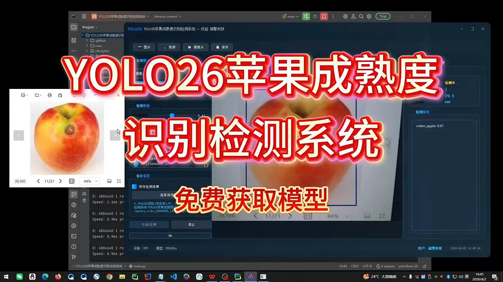
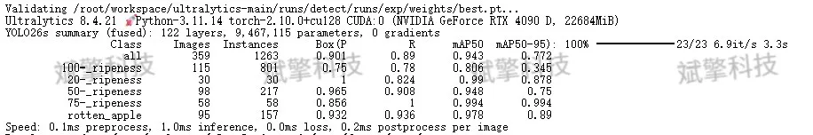
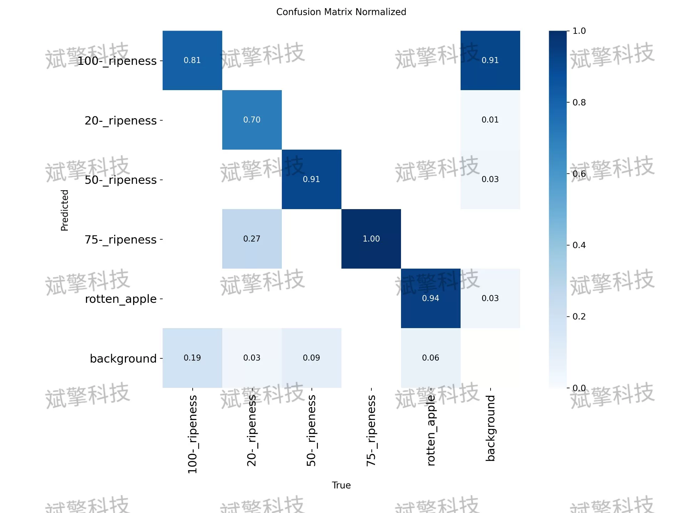
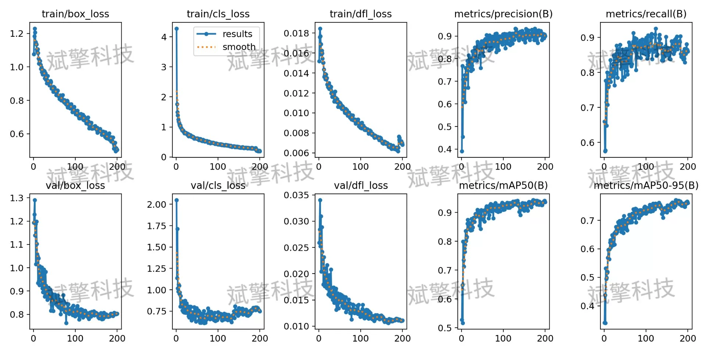
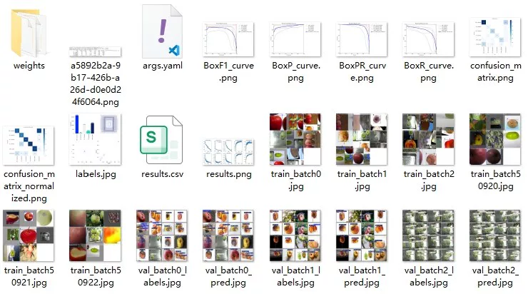
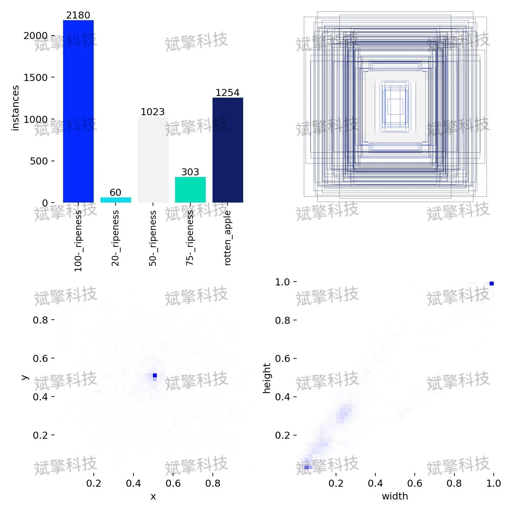
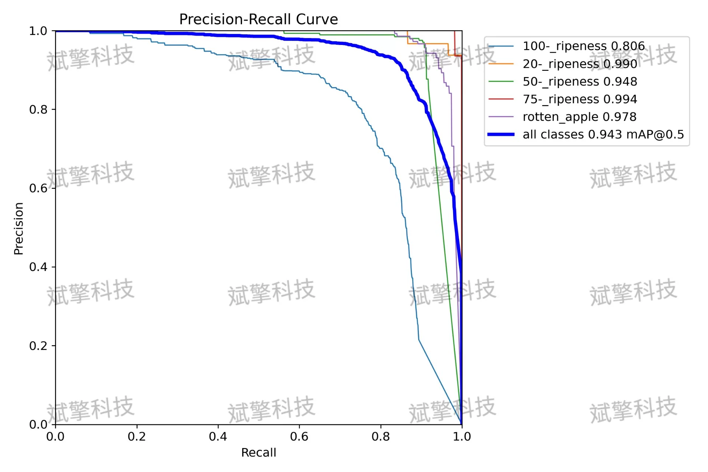
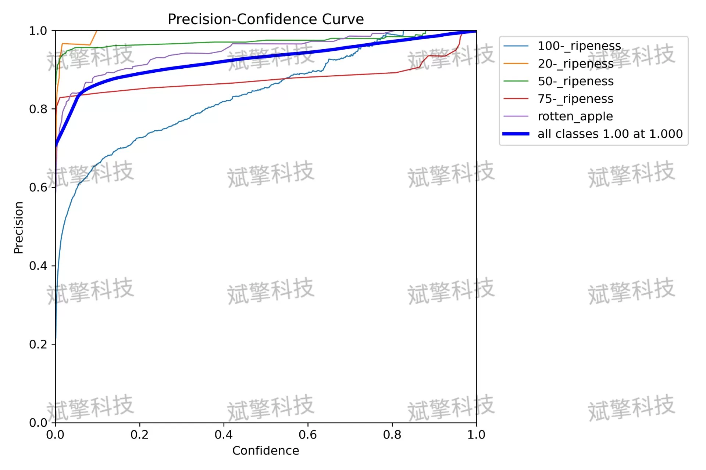
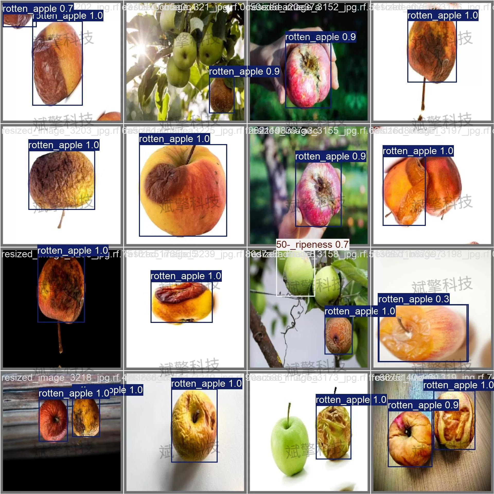

# YOLOv26 Apple Maturity Detection System | Source Code

## Body

YOLO26 Apple Maturity Detection System | Source Code: A Smart Agriculture Tool: An Apple Maturity Automatic Detection System Based on YOLO26 (5-Level Classification / 94.3% mAP)

Addressing the issue of manual labor, low efficiency, and subjectivity in apple maturity identification in apple sorting, this paper constructs an apple maturity recognition detection system based on the YOLO26 algorithm. The system defines five categories: 20% ripeness, 50% ripeness, 75% ripeness, 100% ripeness, and rotten apples. The experiment uses the YOLO26 model, training and evaluating on a private dataset containing 2144 training images, 359 validation images, and 225 test images. The experimental results show that the overall mAP50 reached 94.3%, with mAP50 values of 99.0%, 99.4%, and 97.8% for 20% ripeness, 75% ripeness, and rotten apples respectively, and inference speed reaching 1.0ms/image, meeting real-time detection requirements. Although the recognition accuracy for 100% ripeness is relatively low, the overall system performs well in the automatic recognition task of apple maturity, possessing high practicality and promotional value.

Based on the maturity and quality condition of the apples, five categories are defined:
20-ripeness: Low maturity, primarily green skin with minor color change
50-ripeness: Half ripe, red and green intermixed
75-ripeness: Medium to high maturity, mostly color change but still green
100-ripeness: Full maturity, typical commercial fruit color
rotten_apple: Rotten apples, with brown spots, softening, or mold
Data division
Training set: 2144 images
Validation set: 359 images
Test set: 225 images

Free appointment for remote installation. Unsuccessful full refund.
Purchase Enjoy the following resources (Baidu Drive automatically unlocks):
YOLO Identification Detection Project Complete Source Code
YOLO format datasets
Training code + UI interface code
Trained model + result images
Software installer
Add WeChat to make an appointment for remote installation (automatically displayed WeChat ID after purchase) - Unsuccessful, full refund

⚙️ Core function modules
Detection capability
Image detection: Upon upload, return detection boxes + category information
Video detection: Supports video files, analyzes frames accurately
Camera real-time detection: Connects to USB camera, achieves dynamic monitoring
Interaction and control
Target selection: Choose one or more categories for detection
Parameter adjustment: Adjustable confidence threshold & IoU threshold, flexibly control precision
Result saving: Save images/videos/camera detection results in one click
System and data
User login registration: Supports password strength detection + encryption storage
Log recording: Auto-record operation and error information (timestamped)

## Images

## Payment

Here is a pay link on Stripe ( https://buy.stripe.com/3cs8yP7sY87d0vu9AB ). Please contact me lonlonago@foxmail.com after funding $89, and I will send you a complete data files , thank you!

